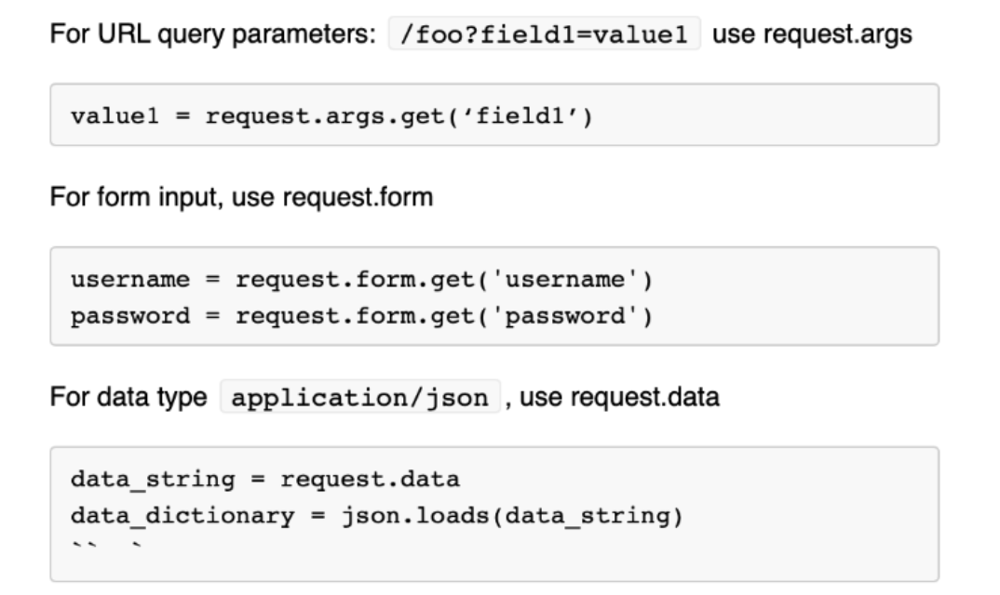

# FullStackDevelopment Notesheet

Notes taken from the Udacity fullstack development course
## Database commands:
Installation: `$ brew install postgres` <br>
Start Postgres server:```$ pg_ctl -D /usr/local/var/postgres start ```<br>
Stop Postgres server:```$ pg_ctl -D /usr/local/var/postgres stop ```

### Initial installation settings for Postgres:
The initial installation will:

* create an initial database named ```postgres```
* create an initial user named ```postgres```. Your ```postgres``` user will have no password set by default.
* create initial databases called ```template1``` and ```template0```. Any other database created after ```template1``` is a clone of ```template1```, including its tables and rows. If you add rows (objects) to ```template1```, they will be copied onto future created databases. ```template0```, on the other hand, should stay "pure" and never be changed.
* The default host machine that runs your postgres server, on your machine, is localhost ``(aka, 127.0.0.1)``
* The default port traditionally used to host your server is port ``5432``. There are very few reasons to use a different port than `5432`.<br>

**Default settings**:
Host:	localhost,
Port:	5432,
Username:	postgres,
Password:	(left blank)

### Postgres CLI tools:
**Log in** as a particular user: `sudo -u <username> -i`<br>
**Create** a new database: `createdb <database_name>`<br>
**Destroy** a database: `dropdb <database_name>`<br>
**Reset** a database: `dropdb <database_name> && createdb <database_name>`<br>
**Interact** with database: `psql <database_name>`<br>
**List** databses and owners: `\l`<br>
**Quit** psql: `\q`<br>
**View database tables**: `\dt`<br>
**View schema of table**: `\d <table>`<br>
**Connect to another db**: `\c <database_name>`<br>


## SQLAlchemy:
* SQLAlchemy is the most popular open-source library for working with relational databases from Python.
* It is one type of ORM library, AKA an Object-Relational Mapping library, which provides an interface for using object oriented programming to interact with a database.

### Benefits
* Can work entirely in python (don't need to write raw SQL queries).
* Can use SQLite for development and can switch to Postgres for production

#### SQL Connection pool
* Handles dropped connections
* Avoids doing many small calls to DB
* Avoids opening and closing connections for every data change

#### Engine
* Low level layer for interacting with database.
* Similar to psychopg2 where you manage a connection directly

#### SQLAlchemy ORM
* Highest layer of absraction in SQLAlchemy
* Wraps the SQL Expressions and Engine to work together to interact with the database


#### Flask commands

**Live reload** Method 1:  `FLASK_APP=app.py FLASK_DEBUG=true flask run`<br>
**Alt. running app** with debug mode on so that you can refresh the localhost page instead of running the .py program again: `if __name__ == '__main__':
app.run(debug = True)`

**Connecting to database with SQLAlchemy**


#### Code
`db = SQLAlchemy(app)` where db is an instance of the database <br>
`db.Model`: Ability to create and manipulate data models <br>
`db.session` Ability to create and manipulate database transactions <br>
`db.create_all()` Detects models and creates tables for them (if they don't exist) <br>
Interactive commands you can enter to query data from db <br>
`from flask_hello_app import Person, db`<br>
`Person.query.all()`<br>
`Person.query.first()`<br>
`query = Person.query.filter(Person.name == 'Rahul')`<br>
`query.first()`<br>
`query.all()`<br>
Can use `db.session` to insert records into a table <br>
`db.session.add()` : adds record into db <br>
`db.session.commit()` : commits those changes in add into the db <br>

**Postgres datatype definition**


**Constraints**: Done to ensure data integrity and consistency


**Adding Values to db**


**Object lifecycle stages**


A **flush** takes pending changes and translates it into commands ready to be committed.
<br>A **commit** leads to a persisted change to a db and lets the db.session start a new transaction. <br>


## Web app building
**Models:** Essentially data, or tables in app <br>
**Views:** How things are represented visually <br>
**Controllers:** Action and logic to take to display views based on data <br>

**Getting User Data**

We get form data from the keys with the html name attribute.


## API

**Hypertext transfer Protocol:** Protocol that allows provides a standardized way for computers to communicate with each other. <br>
**Connectionless:** Client and server only maintain a connection during a request and response.<br>
**Stateless:** No dependency between successive requests.<br>
**Not Sessionless:** Utilizing cookies, sessions can be created to allow each HTTP request to share the same context.<br>
**Media Independent:** Any type of data can be sent as long as both parties know how to handle and recieve the data.<br>

**HTTP Reqests:**
Different request methods indicate different operations to be performed. It's essential to attend to this to correctly format your requests and properly structure an API.

**Request Methods:** <br>
**GET:** ONLY retrieves information for the requested resource of the given URI <br>
**POST:** Send data to the server to create a new resource.<br>
**PUT:** Replaces all of the representation of the target resource with the request data<br>
**PATCH:** Partially modifies the representation of the target resource with the request data<br>
**DELETE:** Removes all of the representation of the resource specified by the URI<br>
**OPTIONS:** Sends the communication options for the requested resource<br><br>
**Status Codes** <br>
`1xx` Informational <br>
`2xx` Success <br>
`3xx` Redirection <br>
`4xx` Client Error <br>
`5xx` Server Error <br> <br>
**Curl:**: Way to transfer data using URL's <br>
**Endpoints** should be organized in `collection/item/collection` and collection should be plural. <br>
**Same Origin Policy** Form of web security that allows scripts from webpage 1 to access data from webpage 2 only if they have the same domain name. Needed to protect users from malicious scripts <br>

#### Containers

**Container vs Virtual machines:** While they both provide a means to solve the 'it works on my computer problem', a container is a less resource intensive way of solving that problem.

In the container model, there are no virtual operating systems or virtual hardware.<br>


A docker engine contains the 'Docker Daemon', 'docker client', and a 'docker api'.

**Docker Commands** <br>

`https://github.com/harnav/pydata-docker-tutorial/blob/master/docker-start/00-dockerclient.org`: Basics github repo <br><br>
`docker pull postgres:latest` Downloads image to your machine. In this case download the latest postgres image. <br>

`docker run --name psql -e POSTGRES_PASSWORD=password! -p 5432:5432 -d postgres:latest`: Run the image. In this case, supplying a password for postgres. <br>

* `--name` Specifies name of container. If none is chosen, docker assigns a random string <br>
* The `-e` flag stands for “environment”. This sets the environment variable `POSTGRES_PASSWORD` to the value `password!`. <br>
* The `-p` flag stands for “publish”. This allows you to bind your local machine’s port 5432 to the container port 5432.
* The `-d` stands for “detach”. This tells Docker run the indicated image in the background and print the container ID. When you use this command, you will still be able to use the terminal to run other commands, otherwise you would need to open a new terminal.

`psql -h 0.0.0.0 -p 5432 -U postgres`: connect with the Docker container database <br>
`\q`: quits connection to postgres <br>
`docker ps`: lists running containers<br>
`docker stop <container_id>`: stops the container
`docker ps -a`: lists contains you have run on your machine.<br>
`docker run -it <name of image>`: go inside container.<br>


## Design Notes
Notes taken from Angela Yu's web dev course. <br><br>
__Main point__: 3 seconds to make a good first impression, so make it count!

### Color theory

#### Complementary Colors useful for images to stand outl


Useful for messing around with different color rules: `https://color.adobe.com/create` <br>
Also: `colorhunt.co` <br>

### Typography
Different types of font elicit different emotions from users and should be used carefully.

* 40 to 60 characters per line is optimal length. You don't want it too long or too short.

### UI design

* Make sure to properly align elements on your website for a more professional look.
* Whitespace adds an elevated/ minimalist look. It helps from keeping things too cluttered.
* Remember to create a design that suits the audience.

### UI design rules
1) Hierarchy <br>
2) Layouts <br>
3) Alignment <br>
4) Whitespace <br>
5) Audience <br>

### UX design rules
1) Simplicity <br>
2) Consistency <br>
3) Reading patterns: ex - use the F-layout/Z-layout<br>
4) All platform design (web/mobile) <br>

Practicing Design:
`https://www.dailyui.co/`
`https://collectui.com/`

`canva` prototyping
